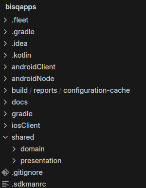
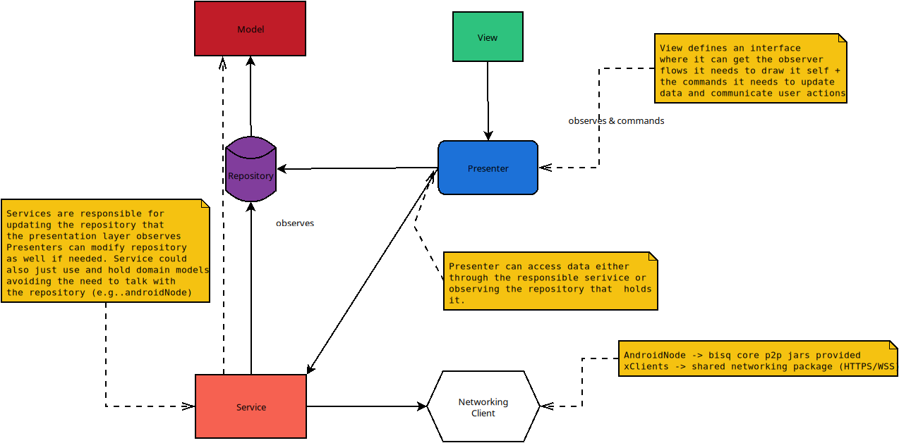

<p align="center">
  
</p>

# Bisq Mobile

<br/>

## Download

This project generates 3 apps from the same codebase: **Bisq Easy Node** (an Android app) and **Bisq Connect** (Android + iOS):

<table align="center">
  <tr>
    <th>Bisq Easy Node <em>(Android)</em></th>
    <th>Bisq Connect <em>(Android)</em></th>
    <th>Bisq Connect <em>(iOS)</em></th>
  </tr>
  <tr>
    <td align="center">
      <a href="https://play.google.com/store/apps/details?id=network.bisq.mobile.node">
        
      </a>
    </td>
    <td align="center">
      <a href="https://play.google.com/store/apps/details?id=network.bisq.mobile.client">
        
      </a>
    </td>
    <td align="center">
      <!-- TODO: Replace with actual TestFlight link when available -->
      <a href="https://testflight.apple.com/join/abBmehCw">
        
      </a>
      <br/><em>TestFlight</em>
    </td>
  </tr>
</table>

<p align="center">
  <strong><a href="https://github.com/bisq-network/bisq-mobile/releases">All releases & changelogs on GitHub</a></strong>
  <br/>
  <a href="https://github.com/bisq-network/bisq-mobile/wiki/How-to-use-Bisq-Connect">Learn how to use Bisq Connect</a>
</p>


## Run a trusted Bisq 2 node

Bisq Connect is a thin client — it trades against a **Bisq 2 node that you, or someone you trust, run** ([why?](#share-a-trusted-bisq-node)). The easiest ways to stand one up, most convenient first:

| Where to run it | Best for | Get it |
|---|---|---|
| **Umbrel — App Store** | One-click install with auto-updates — **recommended** | [apps.umbrel.com](https://apps.umbrel.com/app/bisq2-node) |
| **Bisq 2 Desktop** | Already running Bisq 2 on a desktop? Pair straight to it | [bisq.network/downloads](https://bisq.network/downloads/) |
| **Umbrel — community store** | Community / release-candidate node builds | [bisq-network/bisq2-umbrel](https://github.com/bisq-network/bisq2-umbrel) |
| **Docker** | Self-managed / advanced hosts — build from source | [Docker guide](https://github.com/bisq-network/bisq2/tree/main/apps/api-app/docker) |

The node reaches Bisq's P2P network over its own bundled Tor; pair the mobile app by scanning the QR code the node shows. Full walkthrough: [How to use Bisq Connect](https://github.com/bisq-network/bisq-mobile/wiki/How-to-use-Bisq-Connect).

> **Keep your pairing code private.** The pairing QR / token is a credential that grants control over the node's trades — treat it like a password. Never expose the node's pairing UI or API to an untrusted or public network; keep it on your LAN or reach it over Tor.


## Docs Index

1. [Bisq Mobile](#bisq-mobile)
   - [Run a trusted Bisq 2 node](#run-a-trusted-bisq-2-node)
   - [Goal](#goal)
   - [How to contribute](#how-to-contribute)
     - [Project dev requirements](#project-dev-requirements)
     - [Code Style & Linting](#code-style--linting)
   - [Getting started](#getting-started)
     - [Getting started for Android Node](#getting-started-for-android-node)
   - [Local Env Setup](#local-env-setup)
   - [UI](#ui)
     - [Designs](#designs)
     - [Navigation Implementation](#navigation-implementation)
   - [Configuring dev env: known issues](#configuring-dev-env-known-issues)

2. [Initial Project Structure](#initial-project-structure)

3. [App Architecture Design Choice](#app-architecture-design-choice)
   - [Dumb Views](#dumb-views)
   - [UI independently built](#ui-independently-built)
   - [Encourage Rich Domain well-test models](#encourage-rich-domain-well-test-models)
   - [Presenters guide the orchestra](#presenters-guide-the-orchestra)
   - [Use Cases encapsulate complex workflows](#use-cases-encapsulate-complex-workflows)
   - [Repositories key for reactive UI](#repositories-key-for-reactive-ui)
   - [Services allow us to have different networking sources](#services-allow-us-to-have-different-networking-sources)
   - [What about Lifecycle and main view components](#what-about-lifecycle-and-main-view-components)
   - [When it’s acceptable to reuse a presenter for my view](#when-its-acceptable-to-reuse-a-presenter-for-my-view)
   - [Presenter Lifecycle](#presenter-lifecycle)

4. [Push Notifications](#push-notifications)
   - [Android: Decentralized P2P monitoring](#android-decentralized-p2p-monitoring)
   - [iOS (Bisq Connect): E2E encrypted relay via APNs](#ios-bisq-connect-e2e-encrypted-relay-via-apns)

5. [Why KMP](#why-kmp)

6. [Compose guidelines](./docs/compose-guidelines/README.md)

7. [Architecture & conventions](./docs/architecture.md) — agents: [AGENTS.md](./AGENTS.md)

8. [Testing guide](./docs/TESTING.md) — agents: [AGENTS.md](./AGENTS.md)

## Goal

This project aims to make Bisq Network accesible in Mobile Platforms following the philosofy of Bisq2 - to make it
easier for both, experienced and newcomers, to trade Bitcoin in a decentralized way as well as defending Bisq motto: exchange, decentralized, private & secure.

To achieve this goal, we are building a total of 3 mobile apps that can be divided in 2 categories:

### Run a Bisq (Easy) Node on Mobile

 - **Bisq Easy Node for Android** (Gradle module `:apps:nodeApp`), an Android app that runs Bisq2 core and aims to bring a fully featured trading version of `Bisq2` (also referred to by its main protocol - `Bisq Easy`) to mobile for full privacy & security.

### Share a trusted Bisq Node

 - **Bisq Connect** (Gradle module `:apps:clientApp` for Android and the `iosClient` Xcode project for iOS), a thin Bisq client app that can be configured to connect to a trusted Bisq2 node (over Tor or clearnet) to cater for people willing to try Bisq from somebody they really trust (popularily described as "Uncle Jim") who is willing to share their Bisq node with them.

Want to host that node yourself? See [Run a trusted Bisq 2 node](#run-a-trusted-bisq-2-node) for the ways to run one.

## How to contribute

We follow Bisq standard guidelines for contributions, fork + PR, etc. Please refer to [Contributor Checklist](https://bisq.wiki/Contributor_checklist)

We track work via GitHub issues at https://github.com/bisq-network/bisq-mobile/issues. Pick something that interests you or open a new issue for discussion.

For Jetpack Compose best practices in this project, see the [Compose guidelines](./docs/compose-guidelines/README.md).

### Code Style & Linting

This project uses **ktlint** with **Compose Rules** to maintain consistent code style across the
codebase.

#### Quick Commands

```bash
# Check code style
./gradlew ktlintCheck

# Auto-fix style violations
./gradlew ktlintFormat
```

#### Git Hooks

Git hooks are automatically installed when you sync the project. They will:

- **Pre-commit**: Check ktlint on staged files only (with auto-fix prompt)
- **Pre-push**: Run full ktlint check + unit tests

To bypass hooks temporarily (not recommended):

```bash
git commit --no-verify
git push --no-verify
```

#### CI/CD

All pull requests automatically run ktlint checks in CI. Make sure your code passes locally before
pushing:

```bash
./gradlew ktlintCheck test
```

#### Configuration

- **`.editorconfig`**: Main ktlint configuration with Compose-specific rules
- **`build.gradle.kts`**: ktlint plugin setup (version 1.7.1)
- **Compose Rules**: Enabled for Compose best practices enforcement

For now follow along to learn how to run this project.
If you are a mobile enthusiast and feel driven by Bisq goals, please reach out!

### Project dev requirements

 - Java: 21.0.6.fx-zulu JDK (sdkman env file is avail in project root)
 - Ruby: v3+ (for iOS Cocoapods 1.15+)
 - IDE: We recommend using Android Studio with the Kotlin Multiplatform Mobile (KMP) plugin. For iOS testing you will need XCode installed and updated.

### Getting started

 1. Get [sdkman](https://sdkman.io/) installed since the project uses JDK 
 2. Open Android Studio with the Kotlin Multiplatform Mobile plugin installed and open the project root folder.
 3. Wait for the Gradle sync to complete and download the dependencies. This will let you know what's missing in your machine to run the project. 
    1. If you are on a MacOS computer building the iOS app you can go ahead and run `setup_ios.sh` script and build the project and run it in your device or emulator.
    2. For Android it can run on any machine, just run the preconfigured run configurations `clientApp` and/or `nodeApp` in Android Studio

Alternatively, you could run `./gradlew clean build` first from terminal and then open with Android Studio.

### `Getting started for Android Node`

For the `androidNode` module to build, you need the Bisq2 dependencies. There are two ways to get them:

#### Option 1: For developers (using local Maven repository)

1. Download [Bisq2](https://github.com/bisq-network/bisq2) if you don't have it already
2. Bisq Android Node uses Bisq2 core code by design, this dependency will always be against a bisq2 branch OFF A STABLE RELEASE + commits of current bisq-mobile development.
Check the current codebase bisq-core dependency version in the [toml file](https://github.com/bisq-network/bisq-mobile/blob/main/gradle/libs.versions.toml), at the top of the file `bisq-core` property will have the version (e.g. "2.1.7"). Now go ahead and checkout the bisq2 dev branch for bisq-mobile which follows the pattern `for-mobile-based-on-[VERSION]`(E.g. if the bisq-core-version="2.1.7" then checkout [for-mobile-based-on-2.1.7](https://github.com/bisq-network/bisq2/tree/for-mobile-based-on-2.1.7) - `git checkout for-mobile-based-on-2.1.7`). You can double check if that branch is from the right release line comparing the initial commit of the branch with the tomml `bisq-core-commit` value :)
4. Follow Bisq2 root `README.md` steps to build the project.
5. Run `./gradlew publishAll` // this will install all the jars you need in your local m2 repo


**NOTE #1** For bisq-mobile release the `bisq-core-commit` should point to the exact commit the apps were design to work with

**NOTE #2** if you have troubles publishing the jars try `./gradlew cleanAll buildAll publishAll publishAll -- info` it's known to always update properly

#### Option 2: For CI (using remote Maven repository)

The CI environment automatically uses our remote Maven repository to get the Bisq2 dependencies. No additional setup is required.

Done! Alternatively if you are interested only in contributing for the `xClients` you can just build them individually instead of building the whole project.

### Local Env Setup

**Node**

You just need to run a local bisq seed node from the bisq2 project. By default port 8000 is used

**Clients**

You need to run the seed node as explained above + the http-api module with the following VM parameters

```
 -Dapplication.appName=bisq2_restApi_clear
 -Dapplication.network.supportedTransportTypes.2=CLEAR
 -Dapplication.devMode=true
 -Dapplication.devModeReputationScore=50000
```

Default networking setup for the WebSocket (WS) connection can be found in `gradle.properties` file. You can change there for locally building pointing at the ip you are interested in.

### UI

**Designs**

New feature designs are generated as working Compose `@Preview` composables placed in:
```
shared/presentation/src/commonMain/kotlin/.../presentation/design/<feature>/
```

These are created by an AI design agent that can generate designs from scratch or adapt them from the Bisq2 Desktop codebase. The composables are fully previewable in Android Studio and serve as the reference for implementation. When picking up a GitHub issue that requires UI work, check if designs have been uploaded (look for the `designs-uploaded` label). If not, request them before starting implementation.

Developers should move design composables into the appropriate production package during implementation. Unused designs are easy to locate and clean up since they all live under the `design/` package.

The original Figma designs (legacy reference): https://www.figma.com/design/IPnuicxGKIZXq28gybxOgp/Xchange?node-id=7-759&t=LV9Gx9XgJRvXu5YQ-1

**Navigation Implementation**

Please refer to [this README](shared/presentation/src/commonMain/kotlin/network/bisq/mobile/presentation/ui/navigation/README.md)

### Configuring dev env: known issues

 - Some Apple M chips have trouble with cocoapods, follow [this guide](https://stackoverflow.com/questions/64901180/how-to-run-cocoapods-on-apple-silicon-m1/66556339#66556339) to fix it
 - On MacOS: non-homebrew versions of Ruby will cause problems
 - On MacOS: If Gradle sync fails with "Gradle not found" error, you may need to install gradle with `homebrew` and then run `gradle wrapper` on the root. Then reopen Android Studio and try syncing again.
 - **iOS link errors with `kniprot_cocoapods_Sentry0_*` "symbol multiply defined"**: stale cinterop incremental cache after Kotlin changes near the Sentry cocoapods boundary. Recovery: `./gradlew :apps:clientApp:clean`, then Xcode → Product → Clean Build Folder, then rebuild. Cascading Swift errors (`MainPresenter`/`Koin_coreQualifier` not in scope, etc.) are downstream of this — fixing the link error fixes them too.

### Initial Project Structure



Though this can evolve, this is the initial structure of this KMP project:
 - **shared:domain**: Domain module has models (KOJOs) and components that provide them.
 - **shared:presentation**: Contains UI shared code using Kotlin MultiPlatform Compose Implementation forr all the apps, its Presenter's behaviour contracts (interfaces) and default presenter implementations that connects UI with domain.
 - **iosClient**: Xcode project that generates the thin iOS client from sharedUI
 - **androidClient**: (now found in `apps:clientApp`) Kotlin Compose Android thin app. This app as well should have most if not all of the code shared with the iosClient.
 - **androidNode**: (now found in `apps:nodeApp`) Bisq2 Implementation in Android, will contain the dependencies to Java 17 Bisq2 core jars.

## App Architecture Design Choice



This project uses the [MVP](https://en.wikipedia.org/wiki/Model%E2%80%93view%E2%80%93presenter) (Model-View-Presenter) Design Pattern with variations (__introducing Use Cases, Repositories, and allowing reuse of presenters under specific conditions__) in the following way:

 - **Dumb Views**: Each View defines its desired presenter behaviour. For example, for the `AppView` it would define the `AppPresenter` interface. This includes which data it's interested in observing and the commands it needs to trigger from user interactions.
 - **UI independently built**: The view reacts to changes in the presenter observed data, and calls the methods it needs to inform the presenter about user actions. In this way __each view can be created independently without strictly needing anything else__.
 - **Encourage Rich Domain well-tested models**: Same goes for the Models — they can be built (and unit tested) without needing anything else, simple POKOs (Plain Old Kotlin Objects — meaning no external deps). Ideally business logic should go here and the result of executing a business model logic should be put back into the repository for all observers to know.
 - **Presenters guide the orchestra**: When you want to bring interaction to life, create a presenter (or reuse one if the view is small enough) and implement the interface you defined when doing the view (`AppPresenter` interface for example). That presenter will generally modify/observe the models through a repository and/or a service. The most important thing is that mutable/immutable observability should happen here connecting those fields that the view needs with the real data as appropriate case-by-case.
 - **Use Cases encapsulate complex workflows**: (`NEW!`) When a presenter needs to orchestrate a multi-step process involving several services and repositories, that logic is extracted into a **Use Case** class. Use cases own their own `StateFlow`-based state, coordinate services and repositories in sequence, and expose a clean `execute()` entry point. Presenters observe the use case state and delegate complex operations to it. This keeps presenters lean (focused on UI state mapping) and makes the workflow logic independently testable and reusable across multiple presenters. See `TrustedNodeSetupUseCase` for a reference implementation.
 - **Repositories key for reactive UI**: For the presenter (or use case) to connect to the domain models we use repositories which is basically a storage of data (that abstracts where that data is stored in). The repositories also expose the data in an observable way, so the presenter can satisfy the requested data from the view from the data of the domain model in the ways it see fit. Sometimes it would just be a passthrough. The repositories could also have caching strategy, and persistence. For most of the use cases so far we don't see a strong need for persistence in most of them (with the exception of settings-related repositories) — more on this soon.
 - **Services allow us to have different networking sources**: We are developing 3 apps divided in 2 groups: `node` and `client`. Each group has a very distinct networking setup. We need each type of app build to have only the networking it needs. The proposed separation of concerns not only allows a clean architecture but also allows faster development focus on each complexity separately. We found that for the `androidNode` it makes sense to handle all the domain stuff directly using domain models in the services without connecting to a repository since the bisq-core jars manage all the persistence. You have the option to decide how to connect this in your presenter.


### What about Lifecycle and main view components

As per original specs `single-activity` pattern (or `single-viewcontroller` in iOS) is sufficient for this project. Which means, unless we find a specific use case for it, we'll stick to a single Activity/ViewController for the whole lifecycle of the app.

The app's architecture `BasePresenter` allows a tree like behaviour where a presenter can be a root with dependent child presenters.

We leverage this by having:

 - A `MainPresenter` that acts as root in each and all of the apps
 - The rest of the presenters require the main presenter as construction parameter to be notified about lifecycle events.


### When its acceptable to reuse a presenter for my view?

It's ok to reuse an existing presenter for your view if:

 - Your view is a very small part of a bigger view that renders together (commonly called `Screen`) and you can't foresee reusal for it
 - Your view is a very small part of a bigger view and even if its reused the presenter required implementation is minimal

To reuse an existing presenter you would have to make it extend your view defined presenter interface and do the right `Koin bind` on its Koin repository definition.

Then you can inject it in the `@Composable` function using `koinInject()`.

### Presenter Lifecycle

Presenters are wired to Compose via lifecycle helpers. There are **two lifecycle modes** — choose based on whether the presenter should survive back-stack navigation.

#### `RememberPresenterLifecycle` (default — scope disposed on every navigation)

```
Enter screen → onViewAttached() → coroutines start
Leave screen → onViewUnattaching() → scope disposed, coroutines cancelled
Re-enter     → new presenter instance (factory) → onViewAttached() → fresh start
```

**Use for:** splash, onboarding, settings, dialog presenters, screens that should always start fresh.

#### `RememberPresenterLifecycleBackStackAware` (opt-in — scope survives back stack)

```
Enter screen (first)         → onViewAttached() → coroutines start
Leave screen (to back stack) → onViewHidden() → scope ALIVE, coroutines continue
Re-enter (from back stack)   → onViewRevealed() → scope still alive, no re-subscription
Leave screen (popped)        → onViewUnattaching() → scope disposed (via ViewModel.onCleared)
```

**Use for:** wizard steps (create/take offer), tab screens with expensive data loading, any screen where going back should preserve state, screens that should survive configuration changes (rotation, dark mode).

**How it works:** the presenter is stored inside a `ViewModel` scoped to the `NavBackStackEntry`. The ViewModel is an internal container — the presenter pattern, DI, and testing remain unchanged.

**Bonus — Android config changes survival:** because the presenter lives inside a ViewModel, it automatically survives Activity recreation triggered by configuration changes (rotation, dark mode toggle, language switch). During a config change the lifecycle is `onViewHidden()` → Activity recreated → `onViewRevealed()` — `onViewUnattaching()` is NOT called, so the scope and all in-flight coroutines persist. Screens using `RememberPresenterLifecycle` do NOT get this benefit — they restart from scratch on config changes.

#### Usage in screens

```kotlin
// Default: scope disposed on navigation
@Composable
fun SettingsScreen() {
    val presenter: SettingsPresenter = koinInject()
    RememberPresenterLifecycle(presenter)
}

// Back-stack aware (recommended for most cases): scope survives while on back stack
// Presenter is created once inside a ViewModel — no wasted instances on recomposition
@Composable
fun DashboardScreen() {
    val presenter = RememberPresenterLifecycleBackStackAware<DashboardPresenter>()
}
```

#### Offer flow presenters

Offer flow step presenters (create offer, take offer) extend `OfferFlowPresenter` instead of `BasePresenter` directly. This provides `navigateToOfferbookTab()` for closing the wizard flow. The shared data coordinators (`CreateOfferCoordinator`, `TakeOfferCoordinator`) are **not presenters** — they are Koin singletons that hold mutable wizard state across steps.

## Push Notifications

The project implements two distinct push notification strategies, each with different trade-offs between decentralization and reliability.

### Android: Decentralized P2P monitoring

Both Android apps (Bisq Easy Node and Bisq Connect) use a fully **decentralized, peer-to-peer foreground service** approach. The `OpenTradesNotificationService` runs as an Android foreground service, maintaining a persistent notification while monitoring trade state changes and new chat messages in real time over the existing WebSocket/P2P connection.

**How it works:**

- On app start, a foreground service is launched immediately (before heavy initialization) to satisfy Android's strict timing requirements
- The service observes trade flows and chat messages via `TradesServiceFacade` and `OffersServiceFacade`
- When the app moves to the background, the foreground service keeps the connection alive and delivers local notifications for trade events (state changes, new messages, new trades taken)
- No external servers are involved — notifications are generated entirely on-device from live P2P data

**Trade-off:** This approach is fully private and decentralized — no third-party servers ever see your trade activity. However, if the app is fully killed (e.g. the user swipes it away, or the device restarts), the foreground service stops and no notifications will be delivered until the user opens the app again. Android's OS-level restrictions on background execution make this an inherent limitation of the decentralized approach.

### iOS (Bisq Connect): E2E encrypted relay via APNs

iOS does not allow apps to maintain persistent background connections — the OS suspends apps within seconds of backgrounding and terminates WebSocket connections. A decentralized monitoring approach like Android's is not feasible on iOS.

To provide reliable push notifications on iOS, Bisq Connect uses **Apple Push Notification service (APNs)** with end-to-end encryption, following a model similar to Signal and ProtonMail. This was the most privacy-preserving solution that still delivers a top-class notification experience.

**How it works:**

1. The iOS device generates a 256-bit AES symmetric key and stores it in a shared Keychain accessible by both the main app and the Notification Service Extension (NSE)
2. During registration, the device shares the symmetric key (Base64), APNs device token, and an ECIES public key with the trusted Bisq2 node. The symmetric key is rotated on each re-registration to limit the exposure window
3. When a trade event occurs, the Bisq2 node encrypts the notification payload with AES-256-GCM using the device's symmetric key
4. The encrypted payload is sent via POST to the **bisq-relay server** ([bisq-relay project](https://github.com/bisq-network/bisq-relay)), which forwards it to APNs with `mutable-content: 1`
5. The iOS **Notification Service Extension** (NSE) intercepts the push before display, decrypts it using the shared Keychain key, and shows a privacy-safe category summary (e.g., "Trade update") — never counterparty names, amounts, or trade details on the lock screen
6. When the app wakes up (from background), it replaces the generic NSE notification with a richer, contextual one via the WebSocket data stream. If the app is killed, the NSE notification is all the user sees

**What is protected:**
- The notification content (trade details, messages) is **end-to-end encrypted** — neither the relay server nor Apple can read it
- Lock-screen banners show only category-based summaries (e.g., "Trade update", "New message") — no sensitive trade data is ever displayed on the lock screen
- Remote push notifications are suppressed entirely when the app is in the foreground
- Only the generic notification metadata and timing/frequency are visible to Apple (this is unavoidable with APNs)

**Trade-off:** This delivers reliable, always-on push notifications even when the app is fully killed. The cost is the introduction of centralized infrastructure: a 24/7 **bisq-relay server** and Apple's APNs servers sit in the notification path. While neither can see the notification content thanks to E2E encryption, they do participate in the delivery chain, which is a departure from Bisq's fully decentralized philosophy for this specific platform.

**Developer notes:**
- The NSE target (`BisqNotificationService`) must have `CODE_SIGN_ENTITLEMENTS` pointing to its entitlements file with the shared `keychain-access-groups` entry
- The `KeychainAccessGroup` is injected via Info.plist using `$(AppIdentifierPrefix)` — no hardcoded team IDs
- The `UNUserNotificationCenterDelegate` must be set in `AppDelegate.didFinishLaunchingWithOptions` (not in Kotlin/Compose) to avoid dropped notification tap responses
- Test scripts: `support/test_nse_decryption.swift` (unit tests), `support/test_nse_simulator.sh` (simulator), `support/test_relay_with_nse.sh` (real device via relay)

For more details on the iOS implementation design, see [issue #895](https://github.com/bisq-network/bisq-mobile/issues/895).

## Why KMP

- Native Performance
- Allows us to focus on the "easiest" platform first for the Node (Because of Apple restrictions on Tor and networking in general). Althought unexpected, if situation changes in the future we could cater for an iOS Node.
- Flexibility without the security/privacy concerns of its competitors
- (Node)JVM language allows us to port much of the optimised Bisq code already existing in the Desktop apps
- Kotlin Compose UI allows us to share UI code easily across the 3 apps.

If you are interested in seeing the POCs related to the R&D before this project kicked-off please refer to [this branch](https://github.com/bisq-network/bisq-mobile/tree/pocs)
