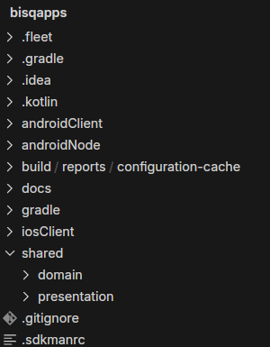
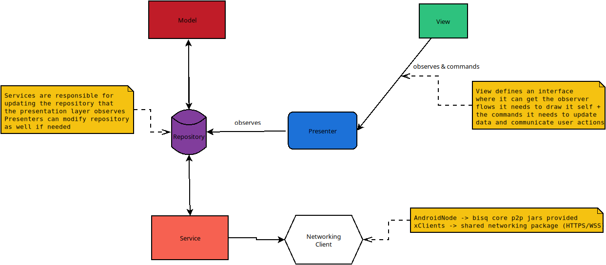

  

# Bisq Mobile

## Goal

This project aims to make Bisq Network accesible in Mobile Platforms following the philosofy of [Bisq2](https://github.com/bisq-network/bisq2/contribute) - to make it
easier for both, experienced and newcomers, to trade Bitcoin in a decentralized way as well as defending Bisq motto: exchange, decentralized, private & secure.

## How to contribute

We follow Bisq standard guidelines for contributions, fork + PR, etc. Please refer to [Contributor Checklist](https://bisq.wiki/Contributor_checklist)

We are currently working in the project definition and Github issues will soon be available for contributors to pick what would they like to help with. Stay tuned for updates.

For now follow along to learn how to run this project.
If you are a mobile enthusiast and feel driven by Bisq goals, please reach out!

### Project dev requirements

 - Java: 17.0.12.fx-zulu JDK (sdkman env file is avail in project root)
 - Ruby: v3+ (for iOS Cocoapods 1.15+)
 - IDE: We use and recommend Fleet, but you may as well use the IDE of your preference. For iOS testing you will need XCode.

**note**: at the time of writing Fleet is in preview, it can get unstable so it's recommended to switch to Android Studio / Xcode as needed. For example, the first time you try to run the iosClient most probably you will need to do it from Xcode.

### Getting started

 1. Download this repo code
 2. Open [Fleet IDE](https://www.jetbrains.com/help/fleet/getting-started.html) and open the `bisqapps` directory you've just downloaded.
 3. Wait for the smart mode to run the `Pre-flight`. This will let you know what's missing in your machine to run the project. Follow its instructions to install everything. The project has an [sdkman](https://sdkman.io/) file, if you have sdkman installed the right java version will be picked up for you.
 4. Once the preflight is successful, you should see all the items checked
    1. If you are on a MacOS computer building the iOS app you can go ahead and open the subfolder [iosClient](./iosClient) with your Xcode, build the project and run it in your device or emulator. After that you can just do it from Fleet
    2. For Android it can run on any machine, just run the preconfigured configurations `androidClient` and/or `androidNode`

Alternatively, you could run `./gradlew clean build` (1) first from terminal and then open with your IDE of preference.

#### UI Designs
androidNode + xClient screens are designed in Figma.
Yet to differentiate between which screens goes into which.

Figma link: https://www.figma.com/design/IPnuicxGKIZXq28gybxOgp/Xchange?node-id=7-759&t=LV9Gx9XgJRvXu5YQ-1

Though the figma design captures most of the functionality, it's an evolving document. It will be updated with new screens, flow updates, based on discussions happening in GH issues / matrix.

### Configuring dev env: known issues

 - Some Apple M chips have trouble with cocoapods, follow [this guide](https://stackoverflow.com/questions/64901180/how-to-run-cocoapods-on-apple-silicon-m1/66556339#66556339) to fix it
 - On MacOS: non-homebrew versions of Ruby will cause problems
 - On MacOS: If Fleet Pre-flight gives error "Gradle not found" and running the (1) terminal command doesn't even run, you need to install gradle with `homebrew` and then run `gradle wrapper` on the root. Then reopen Fleet and try the Pre-flight again.

### Initial Project Structure

Though this can evolve, this is the initial structure of this KMP project:
 - **shared:domain**: Domain module has models (KOJOs) and components that provide them.
 - **shared:presentation**: Contains UI shared code using Kotlin MultiPlatform Compose Implementation forr all the apps, its Presenter's behaviour contracts (interfaces) and default presenter implementations that connects UI with domain.
 - **iosClient**: Xcode project that generates the thin iOS client from sharedUI
 - **androidClient**: Kotlin Compose Android thin app. This app as well should have most if not all of the code shared with the iosClient.
 - **androidNode**: Bisq2 Implementation in Android, will contain the dependencies to Java 17 Bisq2 core jars.

## App Architecture Design Choice

**note** this is being Worked out at the moment

This project uses the [MVP](https://en.wikipedia.org/wiki/Model%E2%80%93view%E2%80%93presenter) (Model-View-Presenter) Design Pattern with small variations (introducing Repositories) in the following way:

 - Each View will define (or reuse) what's the presenter logic it is looking for, including which data its interested in observing in an interface. The view will react to changes in the presenter observed data, and call the methods it needs to inform the presenter about user actions. In this way **each view can be created idependently without strictly needing anything else**
 - Same goes for the Models, they can be built (and unit tested) without needing anything else, simple KOJOs.
 - When you want to bring interaction to life, create a presenter (or reuse one) and implement the interface you defined when doing the view. That presenter will generally modify/fetch the models through a repository.
 - Networking is a crucial part of this project and the networking used and shared by the `xClients` are not the ones used by the `androidNode` but the idea is to have a comprehensive **facade** so that from the point of view of repository/service it just works regardless on how and what objs are being used under the hood to fetch/save data. More on this soon...

## Why KMP

- Native Performance
- Allows us to focus on the "easiest" platform first for the Node (Because of Apple restrictions on Tor and networking in general). Althought unexpected, if situation changes in the future we could cater for an iOS Node.
- Flexibility without the security/privacy concerns of its competitors
- (Node)JVM language allows us to port much of the optimised Bisq code already existing in the Desktop apps
- Kotlin Compose UI allows us to share UI code easily across the 3 apps.